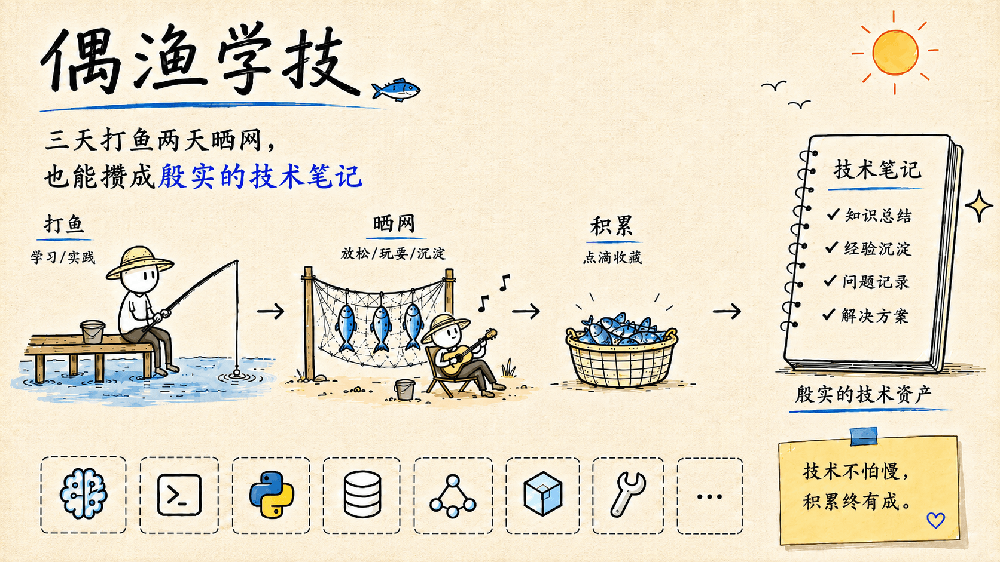

# 🎣 偶渔学技



## 📚 笔记索引

- [🧠 人工智能](#人工智能)
  - [🧬 模型训练](#模型训练)

---

## <span id="人工智能">🧠 人工智能</span>

| 类目 | 笔记 | 日期 | MD | HTML |
|---|---|---|---|---|
| <span id="模型训练">🧬 模型训练</span> | MiniMind / LLM 工程化训练 | 2026-05-15 | [MD](./AI/model-training/2026-05-15/2026-05-15-minimind-llm-training-notes.md) | [HTML](https://babysource.github.io/fitful-tech-notes/AI/model-training/2026-05-15/2026-05-15-minimind-llm-training-notes.html) |

---

## 🤖 辅学技能

**辅学技能适用于智能体自主调用：**

- 🌱 **个性进化**：根据用户使用过程的个性偏好持续进化。
- 🔗 **软链安装**：推荐使用软链方式安装到全局技能目录。

### 🦉 辅学私教（聊即学）

<hr style="height: 1px;" />

**私教式辅学**：构建体系化知识的个性化研习方案并实施渐进式辅学指导。

- **Windows**

```bat
:: 请在仓库根目录执行（示例：Claude Code 安装）

mklink /D "%USERPROFILE%\.claude\skills\fitful-tech-tutor" ".agents\skills\fitful-tech-tutor"
```

- **MacOS / Linux**

```bash
# 请在仓库根目录执行（示例：Claude Code 安装）

ln -s ".agents/skills/fitful-tech-tutor" "$HOME/.claude/skills/fitful-tech-tutor"
```

### ✍️ 辅学笔记（学即记）

<hr style="height: 1px;" />

**伴学式笔记**：将人机学习会话沉淀为结构化的 Markdown 笔记与可视化的 HTML 复习页面。

- **Windows**

```bat
:: 请在仓库根目录执行（示例：Claude Code 安装）

mklink /D "%USERPROFILE%\.claude\skills\fitful-tech-noter" ".agents\skills\fitful-tech-noter"
```

- **MacOS / Linux**

```bash
# 请在仓库根目录执行（示例：Claude Code 安装）

ln -s ".agents/skills/fitful-tech-noter" "$HOME/.claude/skills/fitful-tech-noter"
```

## ⭐ Star History

[](https://www.star-history.com/#babysource/fitful-tech-notes&Date)
